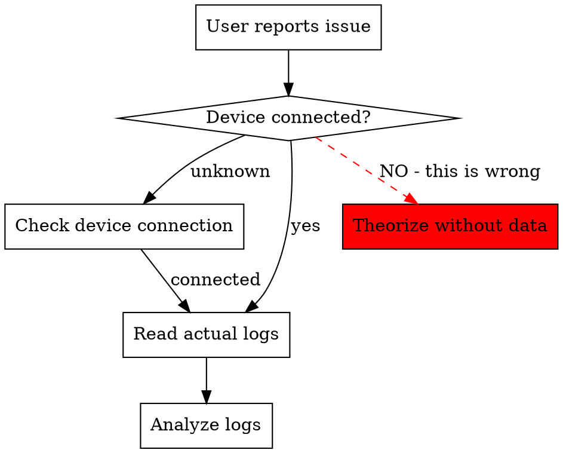

# Flutter Mobile Debugging

## Overview

**You CAN read device logs directly.** Use ADB for Android, Console.app/devicectl for iOS. Read actual logs before theorizing.

## When to Use

Use when:
- App crashes or behaves unexpectedly on device
- User reports "check the logs" or "see what's wrong"
- Debugging performance, video playback, or platform-specific issues
- Comparing emulator vs physical device behavior

## Core Pattern



**Empirical evidence first. Theory second.**

## Quick Reference: Android

| Task | Command | Notes |
|------|---------|-------|
| Check device | `adb devices` | Shows connected devices |
| Read all logs | `adb logcat` | Real-time log stream |
| Filter Flutter | `adb logcat \| grep -i flutter` | Flutter-specific logs |
| Filter errors | `adb logcat *:E` | Error level only |
| Clear logs | `adb logcat -c` | Start fresh |
| Save to file | `adb logcat > ~/Desktop/app_logs.txt` | Capture for analysis |
| Take screenshot | `adb exec-out screencap -p > screen.png` | Visual debugging |
| Current activity | `adb shell dumpsys activity top \| grep ACTIVITY` | What's running |
| App processes | `adb shell ps \| grep [package]` | Process status |
| Install APK | `adb install -r path/to/app.apk` | -r replaces existing |

## Quick Reference: iOS

| Task | Command | Notes |
|------|---------|-------|
| List devices | `xcrun xctrace list devices` | Simulators and devices |
| Console logs | `xcrun simctl spawn booted log stream --predicate 'processImagePath endswith "Runner"'` | Simulator only |
| Physical logs | Open Console.app → select device | Requires macOS |
| Install build | `xcrun simctl install booted path/to/Runner.app` | Simulator |
| Take screenshot | `xcrun simctl io booted screenshot screen.png` | Simulator only |

## Implementation

### Step 1: Verify Device Connection

**ALWAYS start here.** Don't assume device is unavailable.

```bash
# Android
adb devices

# iOS Simulator
xcrun simctl list devices | grep Booted
```

**If no devices:** Tell user to connect device or start simulator.

**If devices found:** Proceed to read logs.

### Step 2: Read Logs

**Critical:** Read logs BEFORE analyzing code. Logs tell you what actually happened.

```bash
# Android: Read recent logs (last 500 lines)
adb logcat -t 500

# Android: Real-time logs with Flutter filter
adb logcat | grep -E '(flutter|E/|FATAL)'

# iOS Simulator
xcrun simctl spawn booted log stream --level debug | grep -i flutter
```

### Step 3: Capture Specific Events

For crash or playback issues:

```bash
# Android: Clear logs, trigger issue, capture
adb logcat -c
# User reproduces issue
adb logcat -d > ~/Desktop/crash_log.txt
```

Read the saved file to analyze crash stack traces, exceptions, or errors.

### Step 4: Device Information

Context matters for device-specific bugs:

```bash
# Android: Device model, OS version
adb shell getprop ro.product.model
adb shell getprop ro.build.version.release

# Android: Screen resolution
adb shell wm size

# Android: Available memory
adb shell cat /proc/meminfo | grep MemAvailable
```

## Common Mistakes

| Mistake | Reality | Fix |
|---------|---------|-----|
| "I can't access device logs" | Bash tool provides ADB access | Run `adb logcat` directly |
| "ADB not available in my environment" | FALSE - Bash can run any command | Use Bash tool with adb |
| "Can't connect to user's device" | Device may be connected already | Check `adb devices` first |
| Asking user to copy logs | You can read them yourself | Use `adb logcat` commands |
| Code analysis before logs | Premature theorizing | Read logs first, then code |
| "Need user to provide info" | Most info is one command away | Run device info commands |

## Red Flags - STOP and Read Logs First

These thoughts mean you're rationalizing:

- "I can't access the device"
- "User needs to run this command"
- "Based on code analysis, I think..."
- "ADB isn't available to me"
- "Let me explain what might be wrong"

**Reality check:** If user asked you to check logs, they expect you to READ THE ACTUAL LOGS.

## Rationalization Table

| Excuse | Reality |
|--------|---------|
| "I can't read device logs" | `adb logcat` works via Bash tool. Try it. |
| "Device might not be connected" | Check first: `adb devices`. Don't assume. |
| "I don't have ADB access" | Bash tool can run any command including adb. |
| "User should provide the logs" | You can get them yourself with one command. |
| "Code analysis is faster" | Logs show what ACTUALLY happened. Code shows what SHOULD happen. |
| "Need user's terminal output" | You have a terminal. Use it. |

**All of these mean: Run the commands. Read the logs. Then analyze.**

## Flutter-Specific Debugging

### Release vs Debug Mode

**Critical:** Release builds remove all `print()` statements.

```bash
# Check build type
adb shell pm list packages -f | grep [your.package]
# Look for "debug" or "release" in path
```

If debugging release build, use `debugPrint()` or `LogUploader` (if project has it).

### Hot Reload Issues

```bash
# Kill app process to force clean restart
adb shell am force-stop [package.name]

# Then run again
flutter run
```

### Video/WebView Issues

```bash
# Android: Check WebView version
adb shell dumpsys webview

# Android: Grant storage permissions (for cached video)
adb shell pm grant [package] android.permission.WRITE_EXTERNAL_STORAGE
```

## The Bottom Line

**You have direct access to device logs through the Bash tool.**

Stop claiming you can't access them. Stop asking users to run commands for you. Stop theorizing before reading empirical evidence.

Read logs first. Analyze second. This is not optional.
