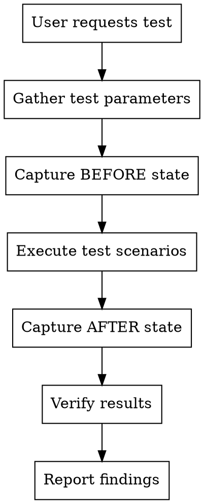

# Flutter Mobile Testing

## Overview

**You CAN test UI changes interactively.** Use ADB to capture screenshots, simulate taps, verify visual changes, and compare before/after states.

**Core principle:** Visual verification requires structured before/after comparison, not ad-hoc exploration.

## When to Use

Use when:
- User modified UI and wants verification it works
- Need to confirm button/element appears correctly
- Testing if interaction (tap, swipe) produces expected result
- Verifying visual changes (colors, layout, text)
- User asks "can you test this on device?"

Do NOT use when:
- Just reading logs (use flutter-mobile-debugging)
- Writing unit/widget tests (use test-driven-development)
- Building APKs or running flutter commands

**Default Mode: FAST**
- Quick verification (1-2 minutes)
- Minimal output - show only results
- No detailed reports unless user asks
- Single screenshot comparison
- Brief summary of pass/fail

**Detailed Mode: Only if user explicitly requests:**
- "Generate a detailed report"
- "Document everything"
- "Create full test documentation"

## Core Verification Pattern



**Key insight:** Always gather test parameters FIRST before executing. Never assume test data or scope.

## Quick Reference: Verification Commands

| Task | Command | Notes |
|------|---------|-------|
| Device connected? | `adb devices` | First command - always check |
| Capture screen | `adb exec-out screencap -p > screen.png` | Save locally |
| UI hierarchy | `adb shell uiautomator dump && adb pull /sdcard/window_dump.xml` | Find elements |
| Tap coordinate | `adb shell input tap X Y` | From UI hierarchy bounds |
| Swipe gesture | `adb shell input swipe X1 Y1 X2 Y2 [ms]` | Pull-to-refresh: swipe down |
| Enter text | `adb shell input text "hello"` | No spaces - use %s |
| Press key | `adb shell input keyevent KEYCODE_BACK` | Hardware keys |
| Launch app | `adb shell monkey -p [package] 1` | Quick launch |
| Clear app data | `adb shell pm clear [package]` | Reset to login |
| Find text in UI | `grep -i "text" window_dump.xml` | Verify element exists |

## 3-Minute Quick Verification

**For simple changes (button added, text changed), use this minimal workflow:**

```bash
# Pre-authorize (5 seconds) - ALWAYS DO THIS FIRST
adb shell echo "ready" >/dev/null 2>&1

# Setup (5 seconds)
cd /tmp && mkdir -p test_$(date +%H%M%S) && cd test_*

# Capture state (15 seconds)
adb exec-out screencap -p > screen.png 2>/dev/null
adb shell uiautomator dump 2>/dev/null && adb pull /sdcard/window_dump.xml ui.xml 2>/dev/null >/dev/null

# Test interaction (30 seconds)
# Extract coordinates: grep "element_text" ui.xml
# Calculate center: (x1+x2)/2, (y1+y2)/2
adb shell input tap X Y
sleep 0.5  # Minimal wait
adb exec-out screencap -p > after.png 2>/dev/null

# Quick report (5 seconds)
echo "✅ Test complete: $(pwd)"
```

**Total time: 1 minute for basic verification (including authorization)**

**Speed tips:**
- Pre-authorize at start to avoid interruption
- Skip verbose output (use >/dev/null 2>&1)
- Minimize sleep times (0.5s usually enough)
- Use parallel commands when possible
- Don't capture unnecessary screenshots
- Generate report ONLY if needed

## Implementation

### Step 0: Gather Test Parameters (ALWAYS DO THIS FIRST)

**CRITICAL: Never assume test data or scope. Always ask user first.**

Use AskUserQuestion to collect:

**For Login Testing:**
```
Questions to ask:
1. Test account credentials (phone number, verification code)
2. Test scope: What scenarios to test?
   - Happy path only (correct credentials)
   - Error cases (wrong phone, wrong code)
   - Edge cases (empty fields, invalid format)
   - All of the above
3. Expected behavior for each scenario
```

**For UI Change Verification:**
```
Questions to ask:
1. What specific change to verify?
2. Where should it appear? (which page/screen)
3. Any interaction needed to trigger it?
4. Expected visual result
```

**For Feature Testing:**
```
Questions to ask:
1. Test data needed (IDs, values, etc.)
2. Test scenarios:
   - Normal flow
   - Error conditions
   - Edge cases
3. Success criteria for each scenario
```

**Example - Login Test:**
```
You: "测试下登录逻辑"

Me: [Uses AskUserQuestion]
- "请提供测试账号和验证码"
- "需要测试哪些场景？"
  [正常登录], [错误手机号], [错误验证码], [空字段], [全部测试]

User answers → Then proceed with testing
```

**Never skip this step. Assumptions lead to wrong tests.**

### Step 1: Verify Device Connection & Pre-authorize

**ALWAYS start here.** Check device availability and trigger ADB authorization before testing.

```bash
# Check connected devices and trigger authorization prompt
adb devices

# Pre-authorize by running a simple command
adb shell echo "ready" >/dev/null 2>&1

# If multiple devices, use -s flag
adb -s DEVICE_ID shell ...
```

**Why pre-authorize:** First ADB command may trigger system authorization dialog. Running a dummy command before testing ensures smooth execution without interruption.

**If no devices:** Tell user to connect device or start emulator.

### Step 2: Establish Baseline (BEFORE State)

Capture current state BEFORE testing changes:

```bash
# Create test directory
mkdir -p /tmp/flutter_test_$(date +%Y%m%d_%H%M%S)
cd /tmp/flutter_test_*

# Capture current screen
adb exec-out screencap -p > before.png

# Dump UI hierarchy
adb shell uiautomator dump
adb pull /sdcard/window_dump.xml before_ui.xml

# Document current activity
adb shell dumpsys activity activities | grep mResumedActivity > activity_log.txt
```

### Step 3: Apply Changes

If changes not yet on device:

```bash
# Hot reload (if flutter run active)
# Tell user: "Press 'r' in your flutter run terminal"

# OR full rebuild and install
cd [project_directory]
flutter build apk
adb install -r build/app/outputs/flutter-apk/app-debug.apk

# OR just restart app if code already updated
adb shell am force-stop [package]
adb shell monkey -p [package] 1
```

### Step 4: Capture After State

```bash
# Wait for app to load
sleep 3

# Capture new screen
adb exec-out screencap -p > after.png

# Dump new UI hierarchy
adb shell uiautomator dump
adb pull /sdcard/window_dump.xml after_ui.xml
```

### Step 5: Verify Changes

**Text verification:**
```bash
# Check if new button text appears
grep -i "forgot password\|忘记密码" after_ui.xml

# Compare with before
diff before_ui.xml after_ui.xml
```

**Visual comparison (requires ImageMagick):**
```bash
# Check if imagemagick available
which compare || echo "ImageMagick not installed"

# Compare screenshots
compare -metric AE before.png after.png diff.png
# Output: number of different pixels
```

**Interactive verification:**
```bash
# Find button coordinates from after_ui.xml
# Example: bounds="[100,500][300,600]" means center at (200,550)

# Tap the button
adb shell input tap 200 550

# Capture result
sleep 2
adb exec-out screencap -p > after_tap.png

# Verify navigation or dialog appeared
adb shell dumpsys activity activities | grep mResumedActivity
```

### Step 6: Generate Report

Create structured test report:

```markdown
## Test Report: [Feature Name]

### Test Date: [timestamp]
### Device: [model from adb shell getprop ro.product.model]
### App Version: [from gradle or pubspec]

### Changes Verified:
- [x] New "Forgot Password" button appears on login screen
- [x] Button positioned correctly below login button
- [x] Tapping button navigates to password recovery screen

### Evidence:
- before.png: Login screen without button
- after.png: Login screen with button
- after_tap.png: Password recovery screen after tap

### Issues Found:
- None / [describe any issues]

### Commands Used:
[paste command sequence for reproducibility]
```

## Common Verification Scenarios

### Scenario 1: New Button Added

```bash
# 1. Baseline
adb exec-out screencap -p > before.png
adb shell uiautomator dump && adb pull /sdcard/window_dump.xml before.xml

# 2. Deploy changes
flutter run  # hot reload

# 3. Capture after
adb exec-out screencap -p > after.png
adb shell uiautomator dump && adb pull /sdcard/window_dump.xml after.xml

# 4. Verify button exists
grep -i "button_text" after.xml

# 5. Verify it wasn't there before
grep -i "button_text" before.xml || echo "✓ Button is new"

# 6. Test interaction
# Extract coordinates from after.xml bounds="[x1,y1][x2,y2]"
# Center point: X=(x1+x2)/2, Y=(y1+y2)/2
adb shell input tap X Y
sleep 2
adb exec-out screencap -p > interaction_result.png
```

### Scenario 2: Text/Color Changed

```bash
# Capture before and after as above

# Use Read tool to view screenshots
# Claude can see images and verify visual changes

# Extract specific elements for comparison
grep "element_id" before.xml
grep "element_id" after.xml
```

### Scenario 3: Pull-to-Refresh Gesture

```bash
# Get screen size
adb shell wm size
# Example: Physical size: 1080x2340

# Swipe down from top center
adb shell input swipe 540 300 540 1200 500

# Capture refresh result
sleep 2
adb exec-out screencap -p > after_refresh.png
```

## Finding UI Element Coordinates

UI hierarchy XML format:
```xml
<node index="0" text="Login"
      bounds="[0,100][1080,200]"
      class="android.widget.Button"/>
```

Calculate tap center:
- X = (0 + 1080) / 2 = 540
- Y = (100 + 200) / 2 = 150
- Command: `adb shell input tap 540 150`

## Common Mistakes

| Mistake | Reality | Fix |
|---------|---------|-----|
| "Can't test UI changes" | ADB provides full testing capability | Use ADB commands above |
| Test without baseline | Can't prove change worked | Capture BEFORE state first |
| Ad-hoc exploration | Wastes time, no reproducibility | Follow structured workflow |
| Assume changes deployed | Hot reload might fail | Verify with screenshot + UI dump |
| Manual coordinate guessing | Inaccurate, wastes attempts | Extract from UI hierarchy XML |
| Skip verification report | No evidence changes work | Generate structured report |
| Stuck on device issues | Code review is faster fallback | If ADB fails after 2 attempts, check code |

## Troubleshooting Device Issues

**Time limit: 2 minutes maximum for device troubleshooting**

If device testing fails:

```bash
# 1. Device not connected (30 seconds)
adb devices
# If empty: Tell user to connect device

# 2. App not responding (30 seconds)
adb shell am force-stop com.ty.kk
adb shell monkey -p com.ty.kk 1
# If still fails: try adb reboot

# 3. Screenshot fails (30 seconds)
adb shell screencap -p | perl -pe 's/\x0D\x0A/\x0A/g' > screen.png
# Alternate method for Windows line ending issues
```

**If device issues persist after 2 minutes:**
1. Tell user about device problem
2. Offer code review instead: "I can verify the code changes while you fix device connection"
3. Don't waste time debugging device setup

## Red Flags - STOP and Follow Workflow

These thoughts mean you're skipping critical steps OR over-engineering:

**Skipping parameter collection (CRITICAL ERROR):**
- "I'll use default test data"
- "User probably wants to test normal flow only"
- "I'll assume the credentials from last time"
- "Let me skip straight to testing"

**Skipping other steps:**
- "I can't test UI interactively"
- "Just checking logs is enough"
- "I'll capture one screenshot"
- "Let me try random coordinates"
- "I don't need before/after comparison"

**Over-engineering (ALSO WRONG):**
- "Let me write a Python script to parse XML"
- "I'll create custom tools for this"
- "I need complex analysis before verifying"
- "Let me build automation framework first"
- "I should generate a detailed report with full documentation"
- "Let me add sleep 2 after every command"

**Reality check:**
- **ALWAYS ask user for test parameters FIRST - never assume**
- If user asked to verify UI change, they expect VISUAL VERIFICATION with EVIDENCE
- Simple verification should take 1-2 minutes, NOT 4-5 minutes
- Use basic commands (grep, diff) before writing custom scripts
- **Efficiency goal: Complete basic verification in under 2 minutes**
- **Report only what user asked for - don't create full documentation unless requested**
- **Minimize sleep times - 0.5s is usually enough, 1s maximum**

## Rationalization Table

| Excuse | Reality |
|--------|---------|
| "I'll use default credentials" | User hasn't provided any. Must ask first. |
| "User wants happy path only" | You don't know that. Ask what scenarios to test. |
| "I remember test data from before" | Session memory isn't reliable. Ask again. |
| "Asking slows down testing" | Wrong test wastes more time. Ask first. |
| "It's obvious what to test" | Different users want different coverage. Ask. |
| "Can't test UI interactively" | ADB provides tap, swipe, screenshot capture. Use it. |
| "Device might not work" | Check in 10 seconds with `adb devices`. Don't assume failure. |
| "Need custom tools first" | grep, diff, adb commands handle 90% of cases. Use simple tools. |
| "Complex analysis needed" | Most UI changes need: capture → compare → tap → verify. Don't overcomplicate. |
| "Python script for XML parsing" | `grep bounds window_dump.xml` finds coordinates. No scripting needed. |
| "Should check code instead" | Code shows intent. Screenshots show reality. Test reality first. |
| "User didn't give exact steps" | You know the workflow: ask params → baseline → test → verify. Follow it. |
| "Taking too long is thorough" | 4+ minutes = over-engineering. 1-2 minutes = efficient testing. |
| "Need to generate detailed report" | User wants results, not documentation. Report only if asked. |
| "Should wait 2 seconds for safety" | UI updates in 0.5s usually. Use minimal waits (0.5-1s max). |
| "Let me document everything" | Capture evidence, show result. Skip narrative unless requested. |

## Tool Requirements

**Required (usually pre-installed):**
- ADB (Android Platform Tools)

**Optional (enhanced verification):**
- ImageMagick (`brew install imagemagick`) - pixel-level screenshot comparison
- Tesseract OCR (`brew install tesseract`) - text recognition in screenshots

**Check availability:**
```bash
which adb || echo "Install: brew install --cask android-platform-tools"
which compare || echo "Optional: brew install imagemagick"
which tesseract || echo "Optional: brew install tesseract"
```

## Flutter-Specific Notes

### Widget Tree vs Native UI

**Limitation:** `uiautomator dump` shows Android native view hierarchy, not Flutter widgets.

- Flutter renders to single `FlutterView` container
- Individual widgets (Text, Button) not visible in XML
- Text content sometimes visible in `text` or `content-desc` attributes

**Workarounds:**
1. Use screenshots + Read tool (Claude can see images)
2. Add semantics labels in Flutter code for better accessibility tree
3. Use Flutter Driver for widget-level testing (different skill)

### Hot Reload Verification

After `flutter run` hot reload:
```bash
# Verify changes applied
adb logcat -t 100 | grep -i "flutter.*reload"

# If not applied, try hot restart
# Press 'R' in flutter run terminal
```

## The Bottom Line

**You have full capability to test Flutter UI changes.**

Stop claiming you can't do interactive testing. ADB provides screenshot capture, element inspection, and interaction simulation.

Follow the structured workflow: baseline → change → verify → report. This is not optional.

Visual verification requires EVIDENCE (screenshots, UI dumps, test reports), not just log reading.
